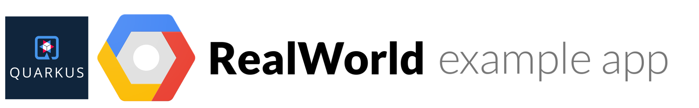

# 

> ### Quarkus Framework running fully serverless on Google Cloud Platform (Cloud Run and Firestore) codebase containing real world examples (CRUD, auth, advanced patterns, etc) that adheres to the [RealWorld](https://github.com/gothinkster/realworld) spec and API.

This codebase was created to demonstrate a fully fledged fullstack application built with [Quarkus](https://quarkus.io/) including CRUD operations, authentication, routing, pagination, and more.

This was forked from https://github.com/diegocamara/realworld-api-quarkus and refactored to work fully serverless on GCPs Cloud Run and Firestore.

For more information on how to this works with other frontends/backends, head over to the [RealWorld](https://github.com/gothinkster/realworld) repo.

#TODO NDK travis build??

[](https://travis-ci.org/nickdk/realworld-api-quarkus)

# How it works

This application uses Quarkus Framework with some other modules:

* Jackson for JSON
* Auth0 java-jwt

On top of these modules it uses officially provided GCP libraries to integrate with and be built on-top of:

* [Cloud Run](https://cloud.google.com/run/docs)
* [Cloud Firestore](https://cloud.google.com/firestore/docs)

### Project structure:
```
application/            -> business logic implementation
+--data/                -> data aggregator classes
domain/                     -> core business package
+-- model/
|   +-- builder/
|   +-- constants/
|   +-- entity/             -> only persistent model classes
|   +-- exception/          -> domain exceptions
|   +-- repository/         -> persistent context abstractions
|   +-- provider/           -> providers abstraction (token, hash, slug)
+-- service                 -> domain bussiness abstraction
infrastructure/             -> technical details package
+-- provider/               -> providers implementaion
+-- repository/             -> repository implementation
+-- web/                    -> web layer package
    +-- config/             -> serializer/deserializer singleton options
    +-- exception/          -> web layer exceptions
    +-- mapper/             -> exception handler mapping
    +-- model/              -> request/response models for web layer
    |   +-- request/        -> request model objects
    |   +-- response/       -> response model objects
    +-- qualifiers/         -> qualifiers for dependency injection 
    +-- resources/          -> http routes and their handlers
    +-- security/           -> web layer security implementation
    |   +-- annotation/     -> name binding annotations
    |   +-- context/        -> security context options
    |   +-- filter/         -> filters implementation for check authentication/authorization rules
    |   +-- profile/        -> security profiles options
    +-- validation/         -> custom validations for request model
```

# Getting started

### Start local server

```bash
 ./mvnw compile quarkus:dev
 ```
The server should be running at http://localhost:8080


### Running the application tests

``` 
./mvnw test 
```

### Running postman collection tests

```
./collections/run-api-tests.sh
```

### Building jar file

```
./mvnw package
```

### Building native executable

GraalVM is necessary for building native executable, more information about
setting up GraalVM can be found in [Quarkus guides](https://quarkus.io/guides/)
and database engine need to be changed.

```
./mvnw package -Pnative
```

## Help
Improvements are welcome, feel free to contribute.